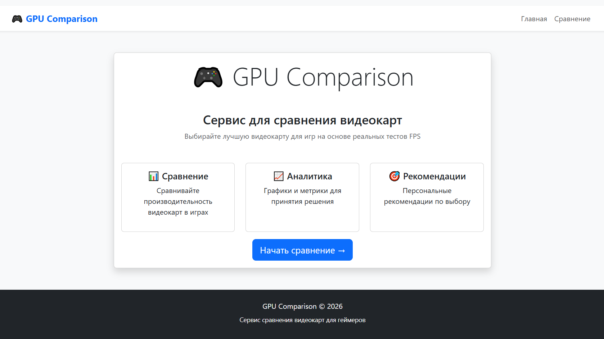
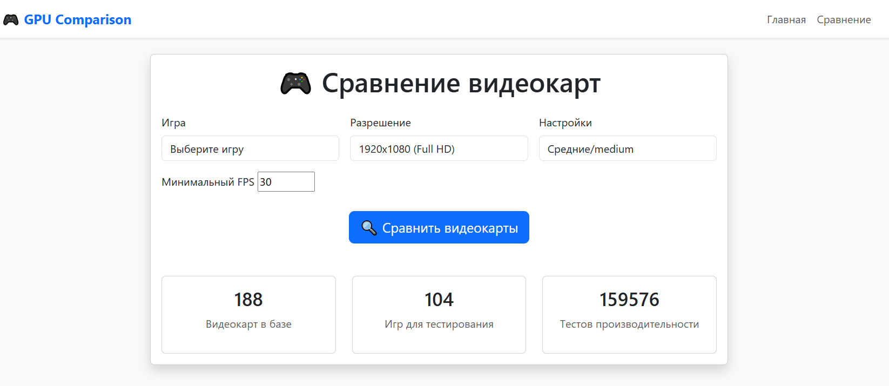
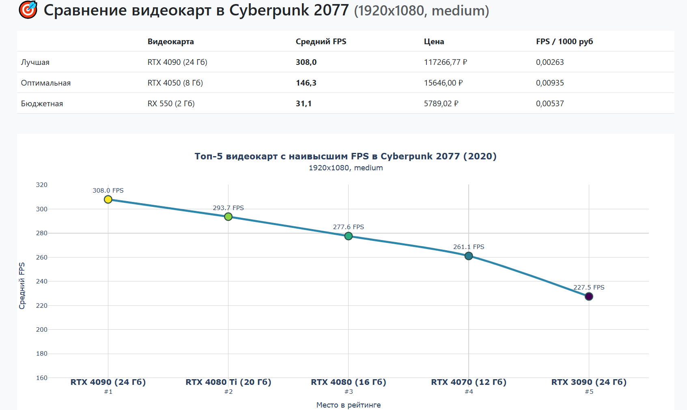

# Техническое задание на проект: Система аналитического сравнения и рекомендации видеокарт для геймеров на основе показателей FPS в популярных играх с расчетом ключевых метрик эффективности

## 1. Цель проекта
Разработать аналитический веб-сервис для сравнения производительности видеокарт в популярных играх. Сервис решает проблему выбора оптимальной видеокарты для геймеров путем анализа данных FPS, расчета ключевых метрик эффективности (стоимость одного кадра и др.) и предоставления персонализированных рекомендаций.

## 2. Роли пользователей
- **Гость**: Может просматривать каталог видеокарт, использовать основной функционал сравнения, видеть результаты аналитики.
- **Администратор**: Полный доступ к админ-панели Django, управление данными моделей, мониторинг пользовательской активности.

## 3. Модели данных

### Модель 1: GPU (Видеокарта)
- `name` (CharField): Полное название модели (например, "NVIDIA GeForce RTX 4070 Ti")
- `manufacturer` (CharField): Производитель (NVIDIA/AMD/Intel)
- `release_year` (IntegerField): Год выпуска
- `memory_gb` (IntegerField): Объем видеопамяти в ГБ
- `price_rub` (DecimalField): Средняя рыночная цена в рублях
- `slug` (SlugField): URL-идентификатор

### Модель 2: Game (Игра)
- `title` (CharField): Название игры
- `release_year` (IntegerField): Год выхода игры
- `slug` (SlugField): URL-идентификатор

### Модель 3: PerformanceData (Данные производительности)
- `gpu` (ForeignKey → GPU): Связь с видеокартой
- `game` (ForeignKey → Game): Связь с игрой
- `resolution` (CharField): Разрешение теста (1080p, 1440p, 4K)
- `graphics_settings` (CharField): Настройки графики (Low, Medium, High, Ultra)
- `avg_fps` (FloatField): Средний показатель FPS

## 4. Ключевой функционал

* **Сценарий 1: Сравнение видеокарт для конкретной игры**
  - Пользователь выбирает игру из списка, разрешение экрана, настройки графики и минимальный fps, который он хочет видеть в игре 
  - Система отображает таблицу с видеокартами из алгоритма рекомендаций и их видеопамять в гигабайтах, производительностью (FPS), ценой в рублях и FPS на 1000 рублей
  - Генерируются интерактивные графики для топ 5 лучших видеокарт в каждой категории из алгоритма рекомендаций

* **Сценарий 2: Аналитическая обработка данных**
  - Система автоматически рассчитывает метрики:
    - **FPS на 1000 рублей** = `avg_fps / (price / 1000)`
  - Алгоритм рекомендаций выделяет:
    - "Бюджетный выбор" (самая дешёвая видеокарта, которая даёт указанный минимум fps)
    - "Оптимальный выбор" (пик кривой эффективности)
    - "Максимальная производительность" (без ограничений по цене)

## 5. Внешние интеграции / Аналитика

### Основной аналитический модуль:
- **Plotly**: Для создания интерактивных графиков:
  - Точечные диаграммы с hover-эффектами

- **Pandas**: Для обработки и анализа данных:
  - Загрузка и предобработка датасетов с производительностью
  - Расчет статистических показателей
  - Агрегация данных для визуализации

### Источники данных:
- **Датасеты Kaggle**: Использование публичных датасетов "GPU Gaming Performance Dataset" для получения эталонных данных FPS
https://www.kaggle.com/datasets/baraazaid/gpus-fps-on-games?resource=download

### Дополнительные библиотеки:
- **Django ORM с аннотациями**: Сложные запросы с расчетом метрик на уровне базы данных
- **Bootstrap 5**: Для адаптивного и современного интерфейса

---

## 6. План реализации (кратко)

**Неделя 1**: Модели, админка, базовые шаблоны  
**Неделя 2**: Логика сравнения, расчет метрик, формы  
**Неделя 3**: Интеграция Plotly, визуализация, фронтенд  
**Неделя 4**: Тестирование, деплой на PythonAnywhere, документация  

---

## 7. Изменения в ходе реализации

*Здесь в процессе разработки будут отмечаться изменения относительно изначального плана.*

1. Отмена регистрации и сценариев для зарегистрированных пользователей
2. Отмена картинок видеокарт (Gpu model)
3. Отмена тепловыделения видеокарт (Gpu model)
4. Отмена типа памяти видеокарт (Gpu model)
5. Отмена метрики FPS на ватт (2 сценарий)
6. Отмена метрики Процент от лидера (2 сценарий)
7. Отмена сценария детального просмотр информации по конкретной видеокарте
8. Отмена сценария сравнение двух видеокарт
9. Отмена сценария фильтрация и сортировка видеокарт
10. Отмена столбчатых диаграмм
11. Уточнение вида Plotly графиков (1 сценарий)
12. Добавление показа кол-ва Гигабайт видеопамяти видеокарт
---

## 8. Скриншоты макетов

---

*Последнее обновление: 20.01.26 1:38